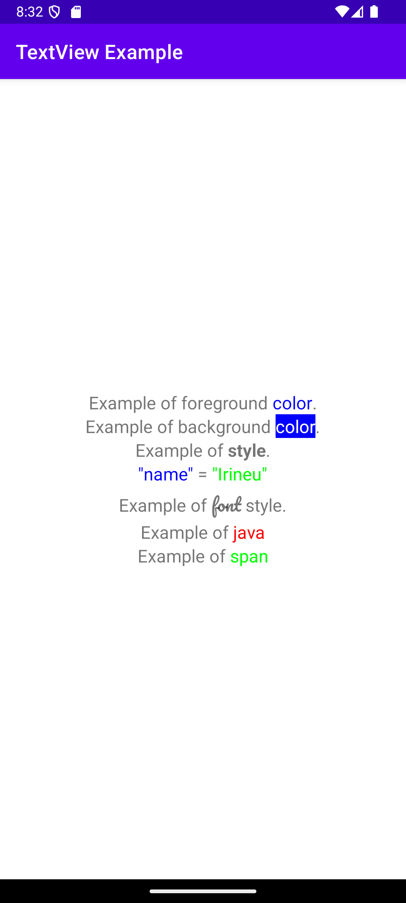

# Highlight 

Cross-platform text highlighting and syntax highlighting for **Compose** and **View**, using regular expressions.

## Objective

Facilitate the creation of dynamic highlights using regular expressions, ideal for code editors or text editors with custom formatting.

## Supported Platforms

| Platform                     | Support |
|------------------------------|---------|
| Android with Jetpack Compose | OK      |
| Android with View            | OK      |
| Compose for Desktop          | OK      |
| Compose for Web              | NO      |
| Compose for iOS              | NO      |

## Quick Start

The main class is `Highlight`, which generates formatted text in types like `SpannedString` or `AnnotatedString`, depending on the platform. 

You can pass a list of schemes directly through the constructor.

### Usage Example

```kotlin
val highlight = Highlight(
    TextColorScheme(
        regex = "\\bcolor\\b".toRegex(),
        match = Match.fully(UiColor.Black)
    )
)

// Jetpack Compose
val annotatedString = highlight.toAnnotatedString("Foreground color example.")

// View-based
val spannedString = highlight.toSpannedString("Foreground color example.")
```

Or use the builder scope to create patterns:

```kotlin
val highlight = Highlight {
    textColor {
        fully(
            regex = "\\bcolor\\b".toRegex(),
            value = UiColor.Black
        )
    }
}

// Jetpack Compose
val annotatedString = highlight.toAnnotatedString("Foreground color example.")

// View-based
val spannedString = highlight.toSpannedString("Foreground color example.")
```

## Compose

In Compose environments, use `rememberAnnotatedString` to integrate highlighting into a `Text` component.

### Usage Example

```kotlin
val highlight = rememberHighlight {
    spanStyle {
        fully(
            regex = "\\bstyled\\b".toRegex(),
            value = SpanStyle(
                color = Color.White,
                background = Color.Black,
                fontStyle = FontStyle.Italic,
            )
        )
    }
}

Text(
    text = highlight.rememberAnnotatedString(
        "Example of styled text."
    )
)
```

Or use `rememberTextFieldValue` for `TextFieldValue`:

``` kotlin
val textFieldValue = rememberSaveable { mutableStateOf(TextFieldValue()) }

BasicTextField(
    value = highlight.rememberTextFieldValue(
        textFieldValue.value
    ).copy(
        composition = null
    ),
    onValueChange = {
        textFieldValue.value = it
    }
)
```

## View-Based

In View-based environments, use `toSpannedString`, or `apply` to apply highlights.

### Usage Example

``` kotlin
val highlight = Highlight {
    backgroundColor {
        fully(
            regex = "\\bcolor\\b".toRegex(),
            value = UiColor.Blue
        )
    }
    textColor {
        fully(
            regex = "\\bcolor\\b".toRegex(),
            value = UiColor.White
        )
    }
}

// TextView
binding.tvExample.text = highlight.toSpannedString(
    "Background color example."
)

// EditText (Editable or Spannable)
highlight.apply(binding.etExample)
```

## Groups

Instead of applying the highlight to the entire match using `Match.fully(..)`, you can separate it by groups, allowing for more complex and specific highlights.

### Usage Example

```kotlin
val highlight = rememberHighlight {
    textColor {
        groups(
            regex = "(\\w+)\\s*=\\s*(\\w+)".toRegex(),
            UiColor.Blue,
            UiColor.Green
        )
    }
}

Text(
    text = highlight.rememberAnnotatedString("name = Highlight")
)
```

## Screenshots

| Simple example                                    | Code highlight                                    |
|---------------------------------------------------|---------------------------------------------------|
|  |  |

## Installation

To integrate the Highlight library into your project, you can add it directly from the [Maven Central repository](https://central.sonatype.com/namespace/com.neoutils.highlight).

### Gradle (Kotlin DSL)

Add the following dependencies to your `build.gradle.kts` file:

```kotlin
dependencies {
    // For highlighting in Views
    implementation("com.neoutils.highlight:highlight-view:2.1.0")
    
    // For highlighting in Compose
    implementation("com.neoutils.highlight:highlight-compose:2.1.0")
}
```